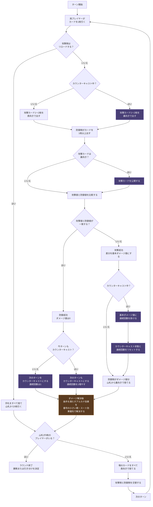

## ゲームの概要

**Countercast** は、2人で遊ぶ対戦カードゲームです。各プレイヤーはジョーカーを除いたトランプ52枚を自分のデッキとして使い、攻撃と防御を繰り返しながら、相手の山札を削っていきます。

攻撃値と防御値が一致すれば防御成功です。防御に成功したプレイヤーは、次の攻撃で「カウンターキャスト」を行うことができます。

ゲームが進むごとに、プレイヤーは特殊カードである「アルカナ」を獲得します。アルカナは特定のスートや数字に対応した効果を持ち、攻防に追加の選択肢を与えます。

## 使用するもの

各プレイヤーはジョーカーを除いたトランプ52枚を用意します。

アルカナカードをすべて裏向きでシャッフルし、共通の山札として使用します。

各プレイヤーのデッキ、捨て札、所持アルカナを置くスペースを用意します。

## カードの数字

カードの数字は、以下のように扱います。

- A = 1
- 2〜10 = その数字
- J = 11
- Q = 12
- K = 13

## ゲームの目的

ラウンド制で、先に3勝したプレイヤーが勝利です。

各ラウンドでは、相手の山札を0枚にすることを目指します。

ターン終了時、山札が0枚のプレイヤーはラウンドに敗北します。

両方のプレイヤーの山札が同時に0枚になった場合、そのラウンドは引き分けです。

---

## ゲームの準備

各プレイヤーは、自分のデッキをシャッフルし、山札にします。

その後、各プレイヤーは山札から5枚引き、手札にします。

## オープニング

各ラウンドの開始時に先手を決めるための手順です。

各プレイヤーは、手札からカードを1枚選び、同時に公開します。

公開したカードの数字が大きい方が最初の攻撃プレイヤー、もう一方は防御プレイヤーになります。

数字が同じだった場合、各プレイヤーは山札から1枚引きます。その後、もう一度手札からカードを1枚選び、同時に公開します。

攻撃プレイヤーが決まるまで、これを繰り返します。

攻撃プレイヤーが決まったら、公開したカードをすべて捨て札に置き、各プレイヤーは山札から1枚引きます。

## ターンの流れ

各ターンは、以下の順番で進みます。

1. ドロー: 各プレイヤーがカードを1枚引く
2. 攻撃: 攻撃側が攻撃カード1~2枚を出す
3. 防御: 防御側が防御カード1枚以上を出す
4. ダメージ計算: 攻撃値と防御値を比較し、差分をダメージ値とする
5. ダメージ解決: 防御側がダメージ値分のカードを山札から捨て札に置く
6. 勝敗判定: 山札が0枚のプレイヤーがいるか確認
7. ターン終了: 場のカードを捨て札にして攻守交替

### 1. ドロー

ターン開始時、各プレイヤーは山札からカードを1枚引きます。

山札にカードがない場合、引けるカードはありません。ただし、敗北するかどうかはターン終了時に確認します。

### 2. 攻撃

攻撃プレイヤーは、手札から以下のどちらかを選んで場に出します。

- カード1枚
- 同じ数字のカード2枚

出したカードの数字の合計が、攻撃値になります。

攻撃プレイヤーは、攻撃の代わりにリロードをすることができます。リロードを行うと、手札をすべて捨てて山札から5枚引き直します。

### 3. 防御

防御プレイヤーは、手札からカードを1枚以上選んで場に出します。

出したカードの数字の合計が、防御値になります。

防御に出すカードの枚数に上限はありません。

### 4. ダメージ計算

攻撃値と防御値を比べます。

攻撃値と防御値が同じ場合は防御成功、違う場合は攻撃成功です。

防御値が攻撃値を超えていても、防御成功にはなりません。完全に同じ値にする必要があります。

### 5. ダメージ解決

防御成功の場合、後述する**カウンターキャスト**が発生します。

攻撃成功の場合、防御プレイヤーはダメージ値1ごとに、自分の山札の上からカードを1枚、裏向きのまま自分の捨て札に置きます。

このカードは、どちらのプレイヤーも見ることができません。

山札の残り枚数より大きいダメージを受けた場合、可能な限りカードを捨て札に置きます。

### 6. 勝敗判定

山札が0枚のプレイヤーは敗北します。

両方のプレイヤーの山札が同時に0枚になった場合、そのラウンドは引き分けになります。

### 7. ターン終了

攻撃プレイヤーと防御プレイヤーが場に出したカードをすべて表向きで捨て札に置きます。

## カウンターキャスト

ダメージ値が0で防御成功になった場合、次のターンが**カウンターキャスト**になります。

カウンターキャストのターン中、攻撃プレイヤー（前のターンで防御成功したプレイヤー）は攻撃カードを裏向きで出します。

裏向きで出した攻撃カードは、防御プレイヤーが防御カードを出した後に公開します。

攻撃成功した場合、カウンターキャストの状態はリセットされます。

## カウンターキャストの重複

カウンターキャスト中の攻撃を防御成功した場合、次のターンもカウンターキャストになります。

連続してカウンターキャストが発生した場合は重複効果が発生します。

攻撃カードを裏向きで出すことに加え、連続回数に応じてダメージが倍化します。

1. 1回目のカウンターキャストが発生 → 次のターンのダメージ値は1倍(通常通り)
2. 1回目のカウンターキャストが防御された → 次のターンのダメージ値は2倍
3. 2回目のカウンターキャストが防御された → 次のターンのダメージ値は3倍

攻撃側が攻撃成功した時、カウンターキャストの状態はリセットされます。

---

## 啓示

2ラウンド目以降の開始時、プレイヤーは**啓示**を受け、アルカナを獲得します。

まず、アルカナの山から3枚を表向きにして、リザーブに加えます。

次に、前ラウンドの敗者、勝者の順に、リザーブからアルカナを1枚ずつ選びます。選んだアルカナは、自分の所持アルカナに加えます。

その後、自分のデッキから「選んだアルカナのスートと数字の両方に合致するカード」を取り除き、アルカナの下に置きます。

選ばれなかったアルカナはリザーブに残ります。

前ラウンドが引き分けだった場合、啓示は行われません。

### 制限と引き直し

自分がすでに所持しているアルカナと同じスートのアルカナは選べません。

自分が選べるアルカナがリザーブにない場合、リザーブを並べ直します。

まず、リザーブにあるアルカナの枚数を数えます。その後、リザーブのアルカナをすべてアルカナの山に戻し、シャッフルします。

そして、アルカナの山から数えた枚数分を表向きにしてリザーブに加え、改めてアルカナを選びます。

## アルカナ

アルカナは、啓示で獲得する特殊なカードです。

各アルカナは、以下の2つの効果を持ちます。

- スート効果
- ナンバー効果

スート効果は、場に出したカードのスートに反応します。ナンバー効果は、場に出したカードの数字に反応します。

### アルカナの対応表

| 番号 | アルカナ | 対応カード |
| ---: | --- | --- |
| 1 | 魔術師 | スペードA |
| 2 | 女教皇 | ハート2 |
| 3 | 女帝 | ダイヤ3 |
| 4 | 皇帝 | クラブ4 |
| 5 | 教皇 | スペード5 |
| 6 | 恋人 | ハート6 |
| 7 | 戦車 | ダイヤ7 |
| 8 | 力 | クラブ8 |
| 9 | 隠者 | スペード9 |
| 10 | 運命の輪 | ハート10 |
| 11 | 正義 | ダイヤJ |
| 12 | 吊るされた男 | クラブQ |

### アルカナ効果の発動

ダメージ解決が終わった後、勝敗判定の前に、場のカードと所持アルカナを確認します。

自分が場に出したカードが、自分の所持アルカナの条件を満たしている場合、そのアルカナ効果を発動できます。

場に出したカードのスートが、所持アルカナのスートと同じなら、スート効果を発動できます。

場に出したカードの数字が、所持アルカナの数字と同じなら、ナンバー効果を発動できます。

複数のアルカナ効果が同時に発動できる場合、数字の小さい順番にアルカナをチェックしていきます。

同じアルカナのスート効果とナンバー効果を同時に発動できる場合、スート効果→ナンバー効果の順で解決します。

条件を満たしていても、同じ効果は1ターンに1回しか発動できません。

例: 魔術師♠1と女教皇♥2と女帝♦3を所持している

♥1と♦1を場に出す場合
1. 魔術師♠1のナンバー効果を1回発動(♦1, ♥1)
2. 女教皇♥2のスート効果を1回発動(♥1)
3. 女帝♦3のスート効果を1回発動(♦1)

♠2と♦2を場に出す場合
1. 魔術師♠1のスート効果を1回発動(♠2)
2. 女教皇♥2のナンバー効果を1回発動(♠2, ♦2)
3. 女帝♦3のスート効果を1回発動(♦2)

## アルカナ効果一覧

| 番号 | アルカナ | スート効果 | ナンバー効果 |
| ---: | --- | --- | --- |
| 1 | 魔術師 | ダメージ1 | ドローX。Xは相手の手札の枚数 |
| 2 | 女教皇 | 治癒1 | リロード。パワーX。Xは捨てたカードの枚数の2倍 |
| 3 | 女帝 | パワー3 | 治癒X。Xはこのターンのダメージ値 |
| 4 | 皇帝 | 各プレイヤーにドロー1 | 相手は手札をランダムに2枚捨てる |
| 5 | 教皇 | 攻撃成功ならドロー1 | ダメージ5 |
| 6 | 恋人 | 治癒2 | パワーX。Xはこのターンのダメージ値 |
| 7 | 戦車 | リロード | パワー7 |
| 8 | 力 | ダメージ2 | ドロー3 |
| 9 | 隠者 | ダメージX。Xは自分のカウンターキャスト回数 | 相手は手札を公開する |
| 10 | 運命の輪 | 治癒3 | 各プレイヤーにリロード |
| 11 | 正義 | パワーX。Xは自分のリロード回数 | リロード。治癒3 |
| 12 | 吊るされた男 | ドロー1 | ダメージX。Xは自分の手札の枚数 |

---

##  キーワード解説

### ドローX

山札からカードをX枚引きます。山札の枚数が足りない場合、引けるだけ引きます。

### ダメージX

対象のプレイヤーは、山札の上からX枚を裏向きのまま捨て札に置きます。このカードは、どちらのプレイヤーも見ることができません。

### 治癒X

自分の捨て札にある裏向きのカードをランダムにX枚選び、山札の一番下に置きます。表向きの捨て札は、治癒では山札に戻せません。

### パワーX

次の自分の攻撃値をX上昇させます。複数のパワーを得た場合、それらは合計されます。攻撃を行った後、使用したパワーは失われます。

### リロード

手札をすべて捨て、山札から5枚引きます。山札の枚数が足りない場合、引けるだけ引きます。

---

## 公開情報

以下の情報は、いつでも確認できます。

- 各プレイヤーの手札の枚数
- 各プレイヤーの山札の枚数
- 各プレイヤーの表向きの捨て札
- 各プレイヤーの裏向きの捨て札の枚数
- 各プレイヤーの所持アルカナ
- リザーブにあるアルカナ

裏向きの捨て札の内容は確認できません。

## フローチャート

## Q&A

### Q. カウンターキャスト状態で、攻撃カードを表向きで出してもいいですか？

いいえ。必ず裏向きで出してください。

### Q. アルカナの効果は複数同時に発動しますか？

はい。条件を満たしていれば複数同時に発動します。

### Q. アルカナ効果を発動させないことはできますか？

いいえ。アルカナ効果は、条件を満たしているものすべてが必ず発動します。発動させたくない場合は、アルカナの条件を満たすカードを場に出さないようにしてください。
